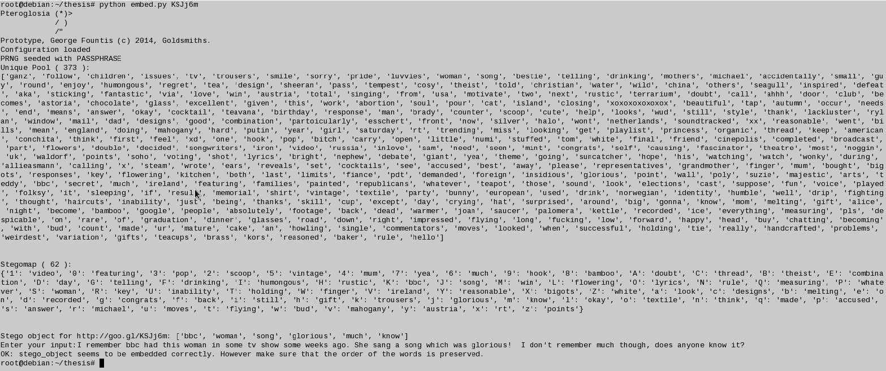
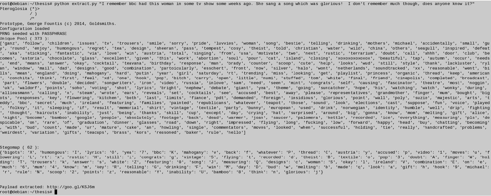

# For historical purposes only.

Proof-of-concept code written as part of my Bsc project. Embeds a shortened goo.gl URL in the text component of a tweet, without any formatting methods, artifacts, or grammars. 

1. Alice and Bob exchange two keys: the first is used as a search term, the second to randomize the order of the dictionary and the mapping of words to goo.gl URL characters. 
2. Alice uses the first key to build a list of matching tweets. She removes stop words,  and other artifacts, and produces a final list that contains only words.
3. Alice uses the second key to either select a random subset from that list, or use the whole list to randomly map the payload. For goo.gl URLs we need to map 62 different characters: [A-Z][a-z][0-9]. If we use a one-to-one mapping, then we need a list of 62 words. Usually the results from a Twitter search contain more. 
 to embed a URL, Alice looks-up the dictionary using the URL characters as keys and retrieves the matching words. She then manually annotates them to produce a passable looking tweet. (See screenshot below)
4. Bob looks up his own copy of the dictionary using the words from Alice's tweet as keys and retrieves the hidden goo.gl URL characters.

# Embedding example (Alice)

# Extraction example (Bob)

# Installation instructions

Before downloading and installing any packages you will need to register the application in Twitter. You can do this by pointing your browser to http://dev.twitter.com/apps and following the instructions to create a new application. 
In the end you should have the following keys:
1.  API key
2.  API secret
3.  Access token
4.  Access token secret

These should be added in the `pteroglosia_keys.private` configuration file. You will need to download and install the Twython library for your system. 
You can find the installation instructions at https://github.com/ryanmcgrath/twython.
